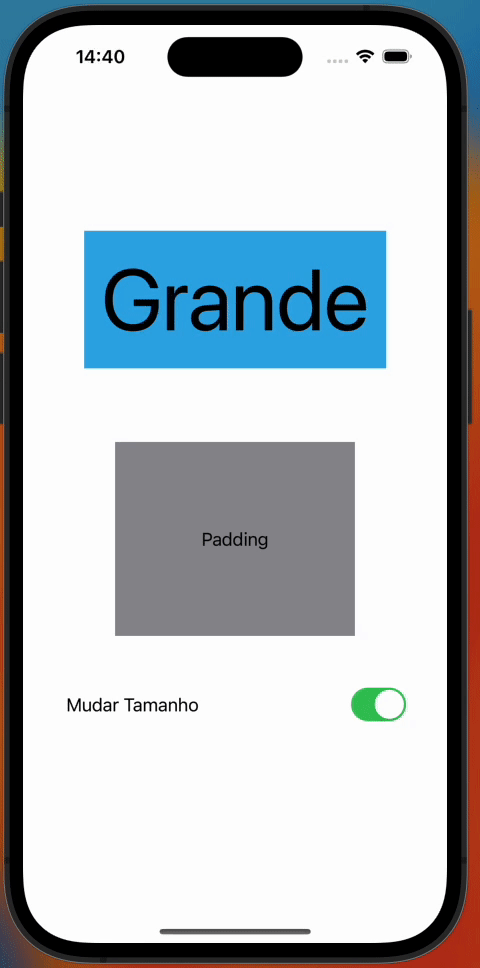
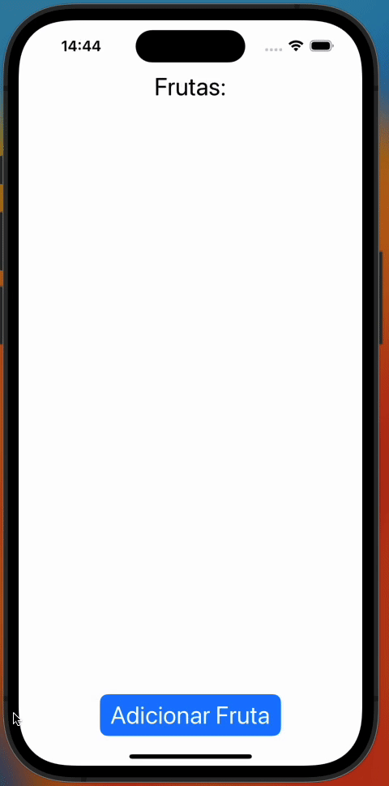
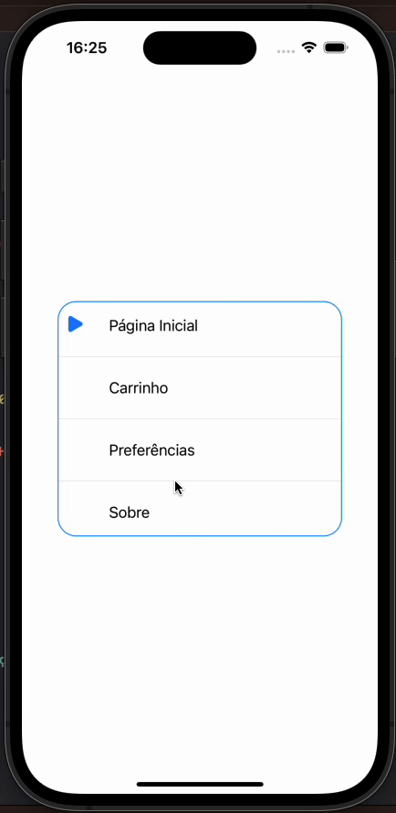

## Animações em SwiftUI

Referências
- https://www.youtube.com/watch?v=K00oSg1gm_0 (CodeWithChris)
- https://www.youtube.com/watch?v=PoeaUMGAx6c (Stanford)
- https://www.youtube.com/watch?v=xGNR7tvDE0Q (Stewart Lynch)
- https://medium.com/simform-engineering/basics-of-swift-ui-animations-d1aa2485a5d9
- https://sarunw.com/posts/animation-delay-and-repeatforever-in-swiftui/
- https://sakunlabs.com/blog/swiftui-identity-transitions/


Pode-se dizer que a maioria das animações possuem três partes:
1. Início - Onde começa o estado da View.
2. Mudança - Onde a animação acontece.
3. Parada - O fim do estado da View.

Em SwiftUI você apenas precisa definir os estados **iniciais** e **finais**. A mudança entre estes dois estados vai ser gerenciada para você de forma automática. Tem várias formas de controlar como ocorrerá esta mudança, por especificar por exemplo a velocidade e duração.

Para que algo seja animado, deve haver **Alguma View** que se **Modifica**

### O que Pode ser Animado?


Basicamente pode-se seguir esta regra geral:

> **Quase todas as propriedades que possuem valores numéricos podem ser Animadas**

Alguns Exemplos:

- Valores RGB da Cor
- Dimensões da View: Altura, Largura
- Entrada e Saída da View na hierarquia
- Offset da Posição
- Rotação
- Shapes

Para que a animação ocorra porém, a view deve modificar estas propriedades condicionalmente. Se você parar para pensar, a animação irá mostrar uma mudança **que já aconteceu**.

### Tipos de Animação


Em SwiftUI há dois tipos de animação, implícita e explícita

#### Animação implícita
Animações implícitas são a maneira mais rápida de implementar visões gerais de animação. É o tipo de animação mais simples no SwiftUI, definido na própria View com um modificador .animation(). O modificador será aplicado para quaisquer alterações que ocorram na View (QUALQUER MUDANÇA SERÀ ANIMADA).

#### Animação explícita
O segundo tipo de animação no SwiftUI é chamado de animação explícita. É definido no evento que irá causar a animação com uma closure withAnimation { … }, e apenas os valores de parâmetro alterados dentro das chaves serão animados. Basicamente, aqui estamos pedindo explicitamente ao SwiftUI para animar as mudanças que ocorrem como resultado de uma mudança de estado. (APENAS O QUE VOCÊ MUDAR SERÁ ANIMADO)


## OK, como eu começo?

Veja este exemplo abaixo, utilizando a animação implícita com o uso do modificador .animation()

```swift
struct Animacao: View {
    @State private var grande = false
    var body: some View {
        VStack {
            Text("Grande")
                .padding()
                .font(.system(size: grande ? 80.0 : 20.0))
                .background(.cyan)
            
            Text("Opacidade")
                .padding()
                .background(.yellow)
                .opacity( grande ? 0.0 : 1.0)
                
            Text("Padding")
                .padding(grande ? 80.0 : 20.0)
                .background(.gray)
            
            
            Toggle("Mudar Tamanho", isOn: $grande)
                .padding(40)
        }
        .animation(.linear, value: grande)
    }
}
```


Veja que há uma variável de estado chamada 'tamanho' que é utilizada para definir o tamanho do texto. Ao clicar o botão, é modificado este valor somando 8 a ele. Agora veja a parte que faz de fato esta mudança causar uma animação:

```swift
    .animation(.default, value: tamanho)
```

Observe que ao especificar o .animation() em um container, você irá propagar o modificador em todas as views desta hierarquia, causando **TODAS** as views serem animadas, se você quiser que animação seja aplicada apenas em uma View, aplique o .animation() apenas nela.

Basicamente, o modificador .animation() está dizendo que será aplicada a curva de animação 'default' caso o valor de estado tamanho mude. Apenas mudanças no valor especificado causarão animação na view.

#### Customizando a animação

Além de .default Há vários tipos de curvas de animação que podem ser aplicados para gerenciar como a mudança acontecerá.

- linear: A animação é executada a uma velocidade constante durante a duração especificada.
- EaseOut: A animação começa rapidamente e diminui conforme o final da sequência se aproxima.
- EaseIn: A sequência de animação começa lenta e acelera à medida que o fim se aproxima.
- EaseInOut: A animação começa lenta, acelera e desacelera novamente.

É possível especificar também a duração que a animação terá, um delay antes da animação acontecer e se ela deve repetir.

Veja o exemplo abaixo uma animação que demora .75 segundos de duração utilizando o easeInOut

```swift
.animation(.easeInOut(duration: 0.75), value: opçãoEscolhida)
```

Outro exemplo, uma animação repete para sempre, esperando 2 segundos de delay a cada loop

```swift
.animation(.linear(duration: 0.75).delay(2).repeatForever(), value: opçãoEscolhida)
```

## Efeitos

Além de controlar quase qualquer propriedade, Há vários efeitos de animação que podem ser aplicados para facilitar a criação de certos efeitos (Rotação, Escala, Opacidade, etc...)

o SwiftUI, os modificadores de efeito são utilizados para aplicar transformações visuais ou animações aos elementos da interface do usuário, como Views e Controls. Esses modificadores permitem que você altere a aparência e o comportamento dos elementos de forma dinâmica, criando uma experiência interativa e agradável para o usuário.

Aqui estão alguns dos modificadores de efeito mais comuns:

- scaleEffect: Este modificador permite escalar uma View aumentando ou diminuindo seu tamanho. Você pode usar um fator de escala para controlar o grau de aumento ou redução.
- rotationEffect: aplica uma rotação a uma View. A rotação é definida em graus e pode ser animada para criar efeitos de giro suaves.
- offset: O modificador offset permite mover uma View em relação à sua posição original. Isso é útil para criar animações de deslocamento ou transições.
- opacity: Com o modificador opacity, você pode controlar a opacidade de uma View, tornando-a gradualmente invisível (opacidade zero) ou visível (opacidade total).
- blur: O modificador blur aplica um efeito de desfoque a uma View, tornando-a embaçada. Isso é útil para criar sobreposições ou destacar conteúdo focado.

## Transições

Transições podem ser aplicadas como uma animação que afeta a View quando é **inserida** ou **removida**.

Para aplicar uma transição é necessário 3 etapas simples:

- Uma forma de adicionar ou remover uma View da hierarquia
- Definir como cada View ou grupo de Views deve ser adicionada e como deve ser removida com o modificador .transition()
- Tornar a animação possível por utilizar o modificador .animation() em alguma View da hierarquia ou com o closure withAnimation { ... } no evento relevante

Sobre Animações de Transição para Views, ainda deve se considerar o seguinte:
* Uma View entrando na tela só é animada se está entrando um container que já está na hierarquia.
* Uma View sainda da tela só é animada se estiver saindo de um container que continuará na hierarquia.

(Ou seja se a inteira hierarquia sair e/ou entrar na tela não será animada.)

Veja uma transição sendo aplicada no exemplo anterior, onde que cada clique do botão um novo texto é inserido na tela

```swift
struct Animacao: View {
    
    @State private var numeroFrutas = 0
    private var frutas = ["Amora","Jabuticaba","Ameixa","Caqui","Caju","Maçã","Jaca","Laranja"]
    var body: some View {
        VStack {
            Text("Frutas:")
            ForEach(frutas[0..<numeroFrutas], id: \.self) { f in
                Text(f)
                    .foregroundColor(.white)
                    .padding()
                    .background(.gray)
                    .clipShape(Capsule())
                    .transition(.asymmetric(insertion: .slide, removal: .scale))
            }
            
            Spacer()
            
            Button("Adicionar Fruta") {
                numeroFrutas = (numeroFrutas + 1) % (frutas.count+1)
            }
            .buttonStyle(.borderedProminent)
        }
        .font(.system(size: 28.0))
        .animation(.default, value: numeroFrutas)
    }
}
```


As transições podem ser escolhidas de forma parecida com o tipo das animações. Inclusive é possível escolher uma transição de entrada diferente da transição de saída com a opção .assymetric()

> Observação: Animações de transição podem não ser exibidas corretamente no Preview do XCode, prefira sempre visualizá-las no Simulator ou aparelho real.


### Matched Geometry Effect

As vezes você quer que uma View se mova de um lugar da tela para outro, Se essa View estiver se movendo dentro do mesmo **Container**, não há problema algum, basta utilizar o .position ou .offset e animar o valor numérico correspondente para a View ser animada.

Agora se você quer que uma View seja transferida para outro **container**, isto não é possível, não com a **mesma View**.

O que é feito é colocar uma View em cada posição e então é aplicada uma transição entre as duas Views, onde que uma irá se mover desaparecendo e a outra se mover aparecendo de forma sincronizada, parecendo ser a mesma View que se deslocou. (Mas na verdade é só uma transição sincronizada)

O exemplo abaixo utiliza o Matched Geometry Effect para que conforme a opção é escolhida um triângulo se desloca para a posição selecionada, destacando-a.

```swift
struct Animacao: View {
    
    @Namespace private var animation
    @State private var opçãoEscolhida = 0
    private var opções = ["Página Inicial","Carrinho","Preferências","Sobre"]
    var body: some View {
        VStack(alignment: .leading) {
            ForEach(0..<opções.count, id: \.self) { qual in
                if qual > 0 { Divider() }
                HStack {
                    if qual == opçãoEscolhida {
                        Image(systemName: "triangle.fill")
                            .renderingMode(.template)
                            .rotationEffect(Angle(degrees: 180.0 + 30.0))
                            .foregroundColor(.accentColor)
                            .frame(width: 32.0,height: 32.0)
                            .matchedGeometryEffect(id: "ESCOLHIDO", in: animation)
                    } else {
                        Text("")
                            .frame(width: 32.0,height: 32.0)
                    }
                    
                    Text(opções[qual])
                        .padding()
                        .onTapGesture {
                            opçãoEscolhida = qual
                        }
                }
                .animation(.easeIn(duration: 0.25), value: opçãoEscolhida)
            }
            .frame(maxWidth: .infinity, alignment: .leading)
        }
        .background {
            RoundedRectangle(cornerRadius: 20)
                .stroke()
                .foregroundColor(.blue)
        }
        .padding(40)
    }
}
```

Para que a Animação de Transição utilizando este feito funcione é necesário basicamente:

- Que a View seja afetada por uma animação, implícita ou explícita.
```swift
  .animation(.easeIn(duration: 0.25), value: opçãoEscolhida)
```
- Criar um Namespace na View onde ocorrerá a transição.
```swift
struct Animacao: View {
    @Namespace private var animation
    ...
    var body: some View {
        ...
```
- Especificar em cada View que irá ser **Transicionada** o modificador .matchedGeometryEffect(), utilizando o mesmo id e namespace nos dois casos.
```swift
.matchedGeometryEffect(id: "ESCOLHIDO", in: animation)
```
- Por último, deve garantir que em nenhum momento as duas Views com o mesmo id existam ao mesmo tempo. Pois a ideia é que a transição ocorrerá entre elas ao uma desaparecer e a outra aparecer.


- FIM