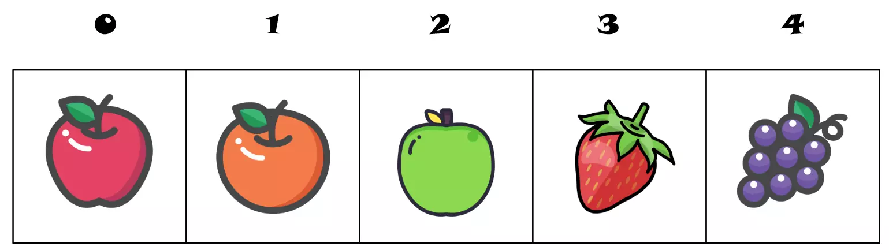

## Arrays
Arrays permitem armazenar dados sequenciais de forma que seja possível acessar cada elemento pelo valor de seu índice.


Para criar um Array em Swift, se utiliza o símbolo [] (Colchetes). Veja o exemplo abaixo de um array de String:
```swift
var nomes: [String] = ["João","Maria","Humberto","Ana"]
```
É possível acessar certos atributos de um array que contém informações relevantes:
```swift
nomes[0]     // --> "João"
nomes[2]     // --> "Humberto"
nomes.count  // --> 4      tem 4 elementos no array
nomes.first! // --> "João" O primeiro elemento do array é João
nomes.last!  // --> "Ana"  O último elemento do array é Ana
```
> O ponto de exclamação em `.first` e `.last` é necessário para converter de opcional para o seu valor, pois o retorno destas propriedades pode ser o valor nulo **nil**. Mais para frente será explicado o que são Opcionais detalhadamente.

### Atravessando Arrays com for

É muito comum a necessidade de atravessar elementos de um array um por um, pode-se fazer isso utilizando o laço for.

```swift
let names = ["Anna", "Alex", "Brian", "Jack"]
for name in names {
    print("Hello, \(name)!")
}
// Hello, Anna!
// Hello, Alex!
// Hello, Brian!
// Hello, Jack!
```

Caso deseje ter o índice de cada item comforme atravessa o array, utilize `enumerated()`:

```swift
var compras = ["Ovos", "Leite", "Farinha"]
for (index,valor) in compras.enumerated() {
    print("Item \(index + 1): \(valor)")
}
// Item 1: Ovos
// Item 2: Leite
// Item 3: Farinha
```

> Para um exemplo utilizando Array e seus métodos veja [Arrays.swift](Exemplos/Arrays.swift)

### Métodos em arrays

Arrays em swift não são fixos em seu tamanho e podem ser manipulados quase como acontece em linguagens como javascript e python, onde na verdade o array se redimensiona automaticamente dobrando sua capacidade para acomodar novos elementos.

**append** - Permite adicionar elementos ao final de um array
```swift
var idades: [Int] = [66,23]
idades.append(88)
idades.append(99)

print(idades) // ->  [66,23,88,99]
```

De forma alternativa, é possível fazer o mesmo por utilizar o operador de concatenação:
```swift
idades += [88,89]
```

**insert** - Permite adicionar elementos em uma posição específica do array
```swift
var idades: [Int] = [66,23]
idades.insert(88, at: 0)
idades.insert(99, at: 0)

print(idades) // ->  [99,88,66,23]
```
> Veja que para especificar a posição que irá ser inserido, se especifica o parâmetro utilizando `at:`, funções em swift podem possuir tanto parâmetros posicionais como parâmetros nomeados, parecido com python

**sort** - Para ordenar o conteúdo do array
```swift
var numeros: [Int] = [4,7,2,8]
numeros.sort()
print(numeros) // ->  [2,4,7,8]
```

**reverse** - Para inverter a ordem do conteúdo do array
```swift
var numeros: [Int] = [4,7,2,8]
numeros.reverse()
print(numeros) // ->  [8,2,7,4]
```

**shuffle** - Para bagunçar um array aleatoriamente
```swift
var numeros: [Int] = [4,7,2,8]
numeros.shuffle()
print(numeros) // ->  [2,4,8,7] (Cada vez que executar será diferente)
```