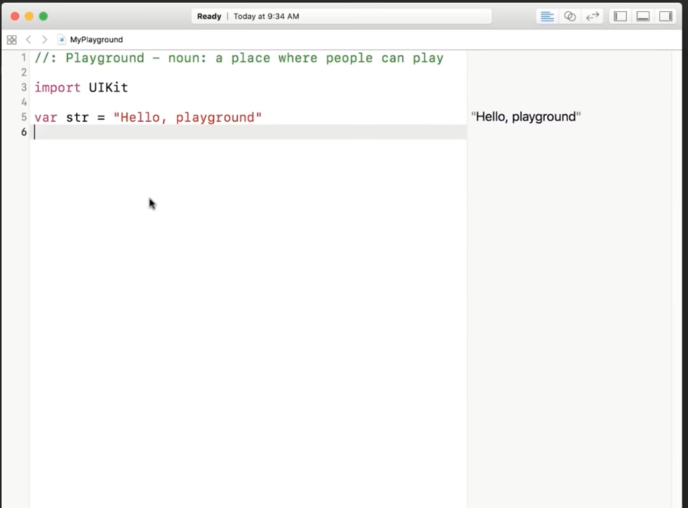

# Hello
[Sources/Hello/Hello.swift](Sources/Hello/Hello.swift)
```swift
print("Olá Swift!")

let a = 1
let b = 2
let c = a + b
print("a + b = \(c)")
```

Para executar este exemplo Hello world, é necessário primeiro montar o seu ambiente para testar estes códigos swift. As seções abaixo explicam como fazer o setup inicial em cada ambiente que você estiver:

## Xcode no MacOS
O recomendado é que você esteja em um Mac com Xcode Instalado. (meio que não há outra forma de realmente desenvolver aplicativos iOS nativos)

O processo para instalar Xcode é muito simples, basta abrir a loja de aplicações e clicar para instalar


Uma vez com o Xcode instalado, para iniciar um ambiente para experimentar a programação em swift clique em playground, seja pelo botão ou pelo menu superior em **File -> New -> Playground**.


No playground é possível programar em swift de forma simples e rápida.

Após escolher o caminho onde salvar o arquivo, irá estar em uma janela parecida com esta, e então você poderá experimentar os exemplos disponibilizados aqui.



## VSCode no Mac ou Linux
Há uma extensão para Swift no VSCode, porém é necessário uma instalação do compilador swift disponível na máquina, por isso, mesmo que você utilize VSCode para programar em swift, é necessário instalar o swift em si. (No MacOS o compilador swift estará instalado se o Xcode estiver instalado)

**Pré Requisitios**
- linguagem swift instalada
- VSCode

No VSCode, instale a extensão Swift de Swift Server Work Group - 
https://marketplace.visualstudio.com/items?itemName=sswg.swift-lang

### Opção 1 - Executando *direto*
A linguagem swift aceita executar arquivos diretamente, basta criar um arquivo com a extensão .swift e colocar algum código swift.

Exemplo, crie um arquivo **Hello.swift** com este conteúdo:
```swift
print("Olá Swift!")
```

Salve o arquivo e execute:
```bash
swift Hello.swift
```

Caso não funcione executar assim, faça a compilação com **swiftc** e então execute o binário resultante:
```bash
swiftc Hello.swift
```

### Opção 2 - Criando um pacote
Com a extensão instalada, você pode criar um projeto para testar códigos Swift

1. Crie um diretório para seu projeto, exemplo `mkdir ProjetoExemplo`
2. entre no diretório `cd ProjetoExemplo`
3. execute `swift package init --type executable`

Pronto, você terá vários arquivos padrão e um arquivo principal (Neste exemplo `Sources/ProjetoExemplo/ProjetoExemplo.swift`) que poderá ser editado de acordo como quiser. 

Para executá-lo:
```bash
swift run
```
E seu código irá executar!

> Estes procedimentos funcionam no Windows, porém é necessário possuir o Visual Studio 2019 instalado e iniciar o VSCode através do terminal `x64 Native Tools Command Prompt for VS 2019` localizado em `C:\ProgramData\Microsoft\Windows\Start Menu\Programs\Visual Studio 2019\Visual Studio Tools\VC`
>
> Isso é necessário para que sejam iniciadas as variáveis de ambiente necessárias para o swift executar