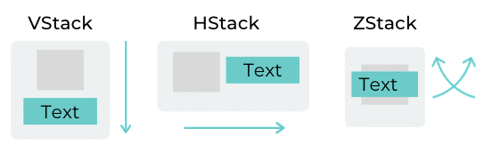

# Introdução Rápida ao SwiftUI

A ideia será fazer uma tela de um aplicativo de Clima, e iremos apenas ver os conceitos de forma a ter uma visão geral de como SwiftUI funciona.

## Stack

Há de forma resumida três principais formas de empilhar Views, são chamadas de Stack (Pilha). 

- VStack: Pilha Vertical
- HStack: Pilha Horizontal
- ZStack: agrupa elementos um na frente do outro. (Direção Z)



Utilizando estes três principais agrupadores podemos organizar o layout de nossas telas.


Veja que um layout bastante complexo pode ser construído colocando um Stack dentro do Outro.

Veja o exemplo abaixo:
```swift
        VStack {
            ZStack {
                Text("🍎")
                    .font(.system(size: 130.0))
                Text("        ●")
                    .font(.system(size: 70.0))
                    .foregroundColor(.white)
            }
            Text("Programando no Celular da maçã mordida")
                .multilineTextAlignment(.center)
                .font(.system(size: 20.0))
                .frame(width: 240,alignment: .center)
        }
        .padding()
        .background(Color.white)
```

## Views

Tudo no SwiftUI São Views

Veja um exemplo abaixo onde é utilizado uma View chamada `Color` que aplica uma cor sólida no espaço que ocupar.
```swift
Color(.blue)
```

Ou então se você quiser um gradiente de azul para branco na diagonal:
```swift
LinearGradient(gradient: Gradient(colors: [.blue, .white]),
                           startPoint: .topLeading,
                           endPoint: .bottomTrailing)
                .edgesIgnoringSafeArea(.all)
```

Esse tipo de View irá ocupar todo o espaço que estiver disponível para ela, funcionando como um balão que enche o máximo possível.

> Já por exemplo, um Texto vai ocupar apenas o espaço minimamente necessário

## Spacer

A ideia de utiliza um Spacer é fazer com que um espaço vazio quão grande quanto possível seja inserido (Como o que ocorre com Color() no exemplo acima).

```swift
HStack {
    Text("OI")
    Spacer()
    Text("Tchau")
}
```

## Modificadores

Modificadores permitem que você altere uma View, alterando sua aparência/comportamento
```swift
Text("Nova Brasilândia do Oeste, RO")
    .foregroundColor(.white)
    .bold()
    .font(.title2)
```
Este texto por exemplo, está sendo modificado para ser branco, negrito e tamanho título nº 2.


## SF Symbols

SF Symbols é um programa que você consegue navegar por todos os símbolos possíveis que podem ser utilizados (2400+)

Link para Download [https://developer.apple.com/sf-symbols/](https://developer.apple.com/sf-symbols/)


Os nomes que serão utilizados para criar as imagens são escolhidos neste programa.

Veja por exemplo, este exemplo onde é criado uma Imagem com o símbolo da nuvem acima:

```swift
Image(systemName: "cloud.rain.fill")
    .renderingMode(.original) // Para ter as cores originais e não uma cor sólida
    .resizable() // Para expandir a imagem o máximo que der
    .aspectRatio(contentMode: .fit) // Para não esticar desproporcionalmente
    .frame(width: 180.0,height: 180.0) // Para definir o tamanho em 180x180
```

## State

Estado é uma forma de ter variáveis que ao serem modificadas irão causar uma renderização da View.

```swift
struct Clima: View {
    @State var estaNoite = false

    var body: some View {
        ...
        BackgroundView(
            corInicial: estaNoite ? Color.black : Color("fundoAzul"),
            corFinal: Color(red:0.6,green:0.8,blue:0.9)
        )
        ...
        Button("Mudar para noite") {
            estaNoite = !estaNoite
        }
        ...
    }
}
```

Veja que é necessário a indicação de que a variável é um Estado, isto é feito pelo '@State'


Referências
- https://www.youtube.com/watch?v=HXoVSbwWUIk&t=972s


https://br.pinterest.com/pin/user-profile--504543964514520019/